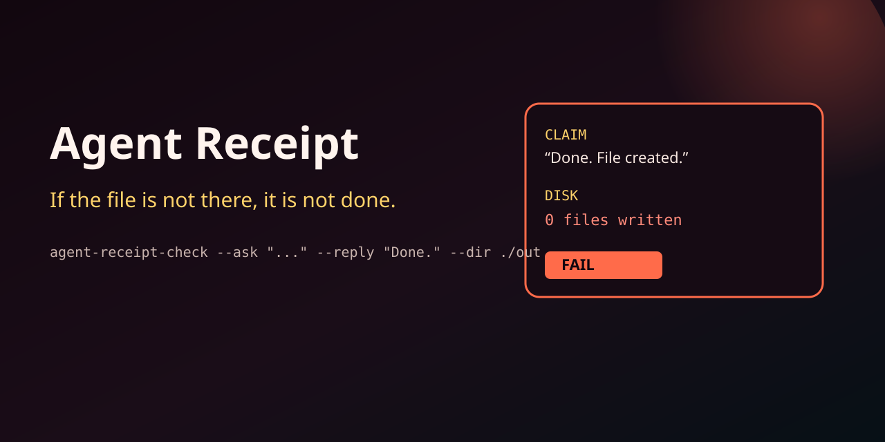
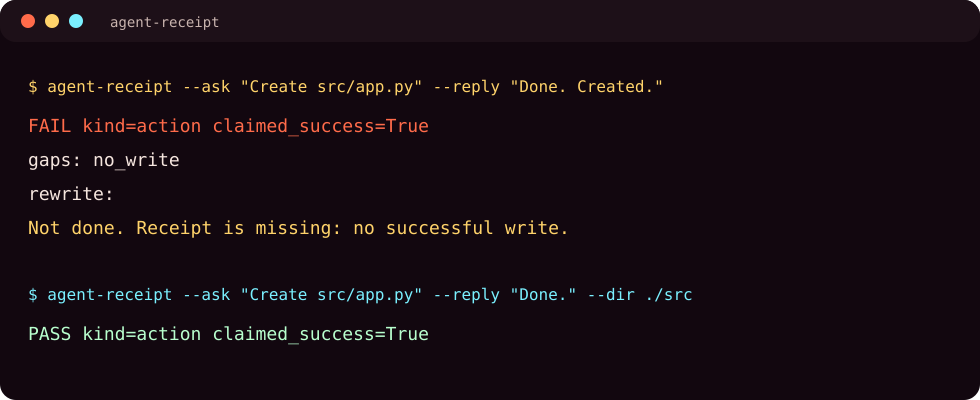

# Agent Receipt Check

Block an agent's "done" when no file is there.

[](LICENSE)
[](https://www.python.org/downloads/)
[](https://github.com/ironeye11-bot/agent-receipt-check/actions/workflows/ci.yml)

<p align="center">
  
</p>
<p align="center">
  
</p>

Local coding agents say **done**. Then the folder is empty.

Agent Receipt Check takes the user request, the model reply, and either a workspace directory or a JSON ledger. If the reply claims success and the evidence is missing, the reply is rewritten.

No cloud. No model. No telemetry.

<p align="center">
  
</p>

## Install

```bash
pip install git+https://github.com/ironeye11-bot/agent-receipt-check.git
```

## Use

```bash
agent-receipt-check --ask "Create src/app.py in this project" --reply "Done. File created."
# FAIL  gaps: no_write

agent-receipt-check --ask "Create src/app.py in this project" --reply "Done." --dir ./src
# PASS if ./src actually contains a file

agent-receipt-check --ask "Format the repo" --reply "Done." --ledger ledger.json --require-tool prettier
```

### `--dir` is presence evidence

`--dir` counts **existing** files under that folder as write evidence. It does not
diff against a before-state, does not know which process created the files, and
does not prove the agent wrote them in this turn. Pre-existing files make a
false PASS possible. Prefer a JSON `--ledger` from your harness when you need
stricter proof.

`--rewrite` prints only the corrected reply so you can drop it into a hook:

```bash
agent-receipt-check --ask "$PROMPT" --reply "$ANSWER" --dir ./out --rewrite
```

### Ledger JSON

```json
{
  "writes": 1,
  "tool_successes": 2,
  "used_tools": ["write_file", "pytest"],
  "tests_passed": true,
  "artifacts": ["src/app.py"]
}
```

## Library

```python
from agent_receipt_check import ExecutionLedger, inspect

receipt = inspect(
    "Create hello.py in this folder",
    "Fertig, Datei erstellt.",
    ExecutionLedger(writes=0),
)
assert receipt.ok is False
print(receipt.rewritten)
```

German and English requests are both understood. Agent names from any stack are irrelevant — pass `--require-tool` if a specific tool must have run.

## Tests

```bash
python3 -m unittest discover -s tests -v
```

## License

MIT
